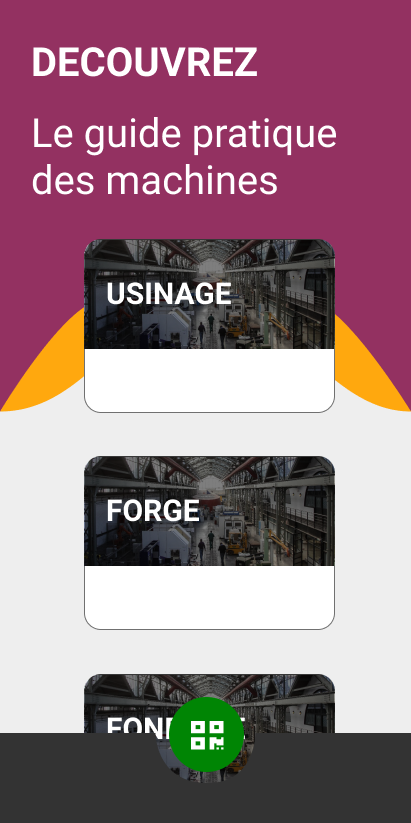
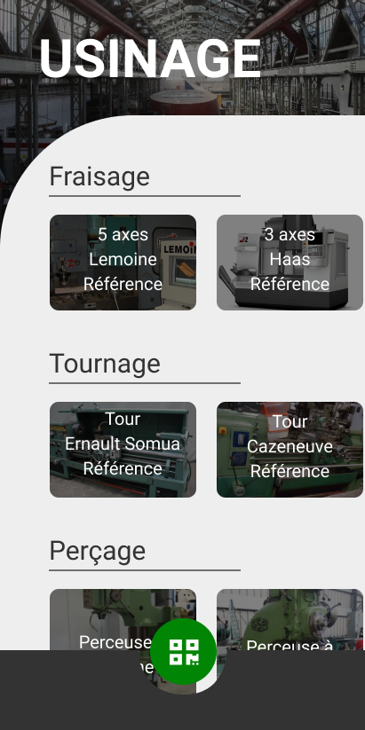
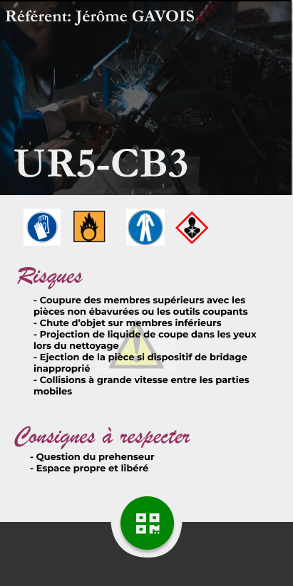
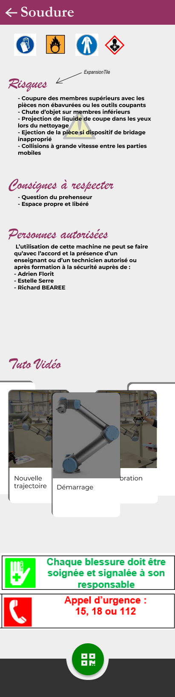

# Flexshop

## What is Flexshop ?
### An educative support
Flexshop can be used as an educative tool to allow students to be more autonomous behind their machines.
### A tool to enhance security
Using the app, you can have direct and quick access to useful security rules, risks and required protection equipment
### And also more
The app is provided as-is but you can use it as you wish !

## Screenshots
UI/UX design work is accessible [here](https://www.figma.com/file/ykqyS6IWuYLVC1BJwBoa2i/Application-ateliers?node-id=0%3A1) please, do not modify unless you know what you're doing

      

## Current tasks to be worked on
- [x] UI/UX design of the app
- [x] Basic implementation of the design using Flutter
- [x] Distant API schema design
- [ ] QR Code implementation in Flutter
- [ ] Slide interface on webapp

## Technological stack
### Mobile app
The mobile architecture uses the following components to work:
- Flutter

Dependencies:
- font_awesome_flutter (^8.8.0)
- google_fonts (^0.3.10)
- flutter_multi_carousel (^1.0.0)
- flare_splash_screen (^3.0.1)
- flare_flutter (^2.0.1)

### Web app
The web app uses the following components to work:
- Node.js

Dependencies:
- express (^4.17.1)
- sqlite (^^3.0.6)
- bluebird (^3.7.2)
- dotenv (^8.2.0)
- multer (^1.4.2)
- twig (^1.15.1)

# Authors
- Fabien AUBRET
    - Lead Project Manager, Developer
    - Engineering student (Mechanical, Manufacturing and Quality Check)
        - Arts et Métiers Engineering school
    - Hobbyist developer (Fullstack)
    - Contact: [fabien.aubret@gadz.org](fabien.aubret@gmail.com)
- Grégoire NIAU
    - Co-Project Manager, Developer
    - Engineering student (Mechanical, Manufacturing and Quality Check)
        - Arts et Métiers Engineering school
    - Hobbyist developer (Python, Flutter)
    - Contact: [gregoire.niau@gadz.org]

# License
 Ce(tte) œuvre est mise à disposition selon les termes de la <a rel="license" href="http://creativecommons.org/licenses/by-nc-sa/4.0/">Licence Creative Commons Attribution - Pas d’Utilisation Commerciale - Partage dans les Mêmes Conditions 4.0 International</a>.